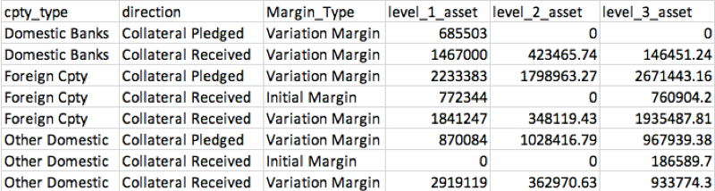
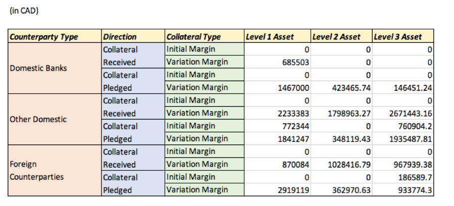
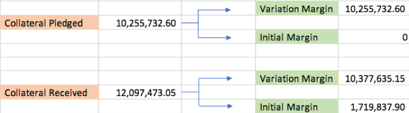

# 加拿大银行抵押品报告

   [English version](README_EN.md)

本报告的目的是向加拿大银行提供相关抵押品的数据。

这些数据对于评估交易对手方与活动之间的联系以及确定不同资产类别之间交易的规模是十分重要的。

此报告使用SQL对原始Excel数据进行提取，整理，处理，分析等。

由此达到报告目的并为加拿大银行提供数据分析后的有效商业建议。

## 背景资料

此业务只在工作日内进行。工作日定义为除联邦和省级法定假日外的所有工作日。

所附模板标识了只需要在每月底更新数据。每个工作日都需要在表格内填写相应数据。


### 资产类型定义

一级资产:政府债券

二级资产:非金融公司债券/股权，信用评级在A - AAA之间。

第三级资产:金融公司债券/股权，或非金融公司债券/股权，信用评级低于A。

### 原始数据
[Collateral transactions as of Jul 2016](原始数据/collateraltransaction.csv)

[Security instrument details](原始数据/security.csv)

[Counterparty details](原始数据/customer.csv)

## 操作流程

### 在SQL数据库创建新表格并导入原始数据

通过以下命令完成：

``` SQL
DROP TABLE IF EXISTS Col_Trans;
CREATE TABLE Col_Trans (
	`Process_Date`	TEXT,
	`Trade_ID`	TEXT,
	`Transaction_Date`	TEXT,
	`Currency`	TEXT,
	`Customer_ID`	TEXT,
	`Encum_Status`	NUMERIC,
	`Product_Type`	TEXT,
	`PV`	DECIMAL(12,2),
	`PV_CDE`	DECIMAL(12,2),
	`Encum_Mat_Date`	TEXT,
	`Margin_Type`	TEXT,
	`Security_ID`	TEXT,
	`Post_Direction`	TEXT,
	`CSA_ID`	TEXT,
	`Quantity`	NUMERIC
);


DROP TABLE IF EXISTS Customer;
CREATE TABLE Customer (
	`Customer_ID`	TEXT,
	`Customer_Name`	TEXT,
	`Industry`	TEXT,
	`Jurisdiction`	TEXT,
	`CreditRating`	TEXT
);


DROP TABLE IF EXISTS Sec;
CREATE TABLE Sec (
	Security_ID	TEXT,
	Security_ID_2	TEXT,
	Issuer	TEXT,
	Issuer_Credit_Rating	TEXT,
	Industry	TEXT,
	Currency	TEXT,
	Security_Type	TEXT,
	Maturity_date	TEXT,
	Issue_Date	TEXT,
	Coupon	TEXT,
	Price	FLOAT,
	Factor	TEXT,
	MTM_Date	TEXT,
	Fixed_Flag	TEXT,
	primary key (Security_ID)
);
```

创建三个表头齐全的空白表格并分别从Excel中导入所需要的原始数据。

‘Col_Trans’记录了2016年间100笔重要交易的信息

‘Customer’ 记录着10位客户的个人背景及所需信息

‘Sec’记录了所有交易的抵押品信息

### 整理并归类原始数据

``` SQL
create table cust2 as
select
      *,
      case
          when industry = 'Financial' and jurisdiction = 'Canada' then 'Domestic Banks'
          when industry <> 'Financial' and jurisdiction = 'Canada' then 'Other Domestic'    
          else 'Foreign Cpty'
      end as cpty_type
from customer
;


create table sec2 as
select
      *,
      case
          when industry = 'Sovereign' and security_type = 'Bond' then 'Level_1_Asset'
          when industry not in ('Sovereign', 'Financial', 'Insurance') 
            and issuer_credit_rating like 'A%' and issuer_credit_rating <> 'A-' then 'Level_2_Asset'
          else 'Level_3_Asset'                                                                          
      end as asset_class
from sec
;
```

按照要求，此步骤是在创建原始表之后整理和分类所有提供的原始数据。

创建新表格‘cust2’，从原‘Customer’表中选择所有列，并使用‘Case When’语句将所有客户筛选并分类为与模板对称的三种对手类型。

创建‘sec2’表格方法相同，将资产按照要求分为三种不同等级。

### 连接表格

通过数据库里的主键，原交易记录表连接‘cust2’和‘sec2’。

并创建新表' cust_join '和' sec_join '。

``` SQL
  
create table cust_join as
select
      a.*,
      b.cpty_type
from col_trans a
left join cust2 b
on a.customer_id = b.customer_id
where a.product_type = 'Security'
;


create table sec_join as
select
      a.*,
      coalesce(b.asset_class, c.asset_class) asset_class     
from cust_join a
left join sec2 b
on a.security_id = b.security_id                             
left join sec2 c
on a.security_id = c.security_id_2
;
```

交易记录表和‘cust2‘之间的主键是‘customer_id’

交易记录表和‘sec2‘之间的主键是‘security_id’

因此，目前“Col_Trans”中的所有交易都可以按照交易对手类型和资产级别两种类别进行归类。

### 根据要求转换数据

```SQL
create table output as
select
      cpty_type,
      case
          when post_direction = 'Deliv to Bank' then 'Collateral Received'
          else 'Collateral Pledged'
      end as direction,
      margin_type,
      sum(case when asset_class = 'Level_1_Asset' then pv_cde else 0 end) level_1_asset,                         
      sum(case when asset_class = 'Level_2_Asset' then pv_cde else 0 end) level_2_asset,                         
      sum(case when asset_class = 'Level_3_Asset' then pv_cde else 0 end) level_3_asset
from sec_join
group by cpty_type, direction, margin_type
order by cpty_type, direction, margin_type
;
```

从‘sec_join’中选择与模板相对应的六列数据。

按照模板将‘Deliv to Bank’和‘Deliv to Ctpy’翻译为‘Collateral Received’和‘Collateral Pledged’。

根据资产类型定义，计算每个资产类型的价值总和。



### 调整最终格式

``` SQL
create table rep_strusct as
select
      a.cpty_type,
      b.direction,
      c.margin_type
from (select distinct cpty_type from output) a
cross join (select distinct direction from output) b
cross join (select distinct margin_type from output) c
order by a.cpty_type, b.direction, c.margin_type
;


create table col_trans_report as
select
      a.cpty_type,
      a.direction,
      a.margin_type as 'Collateral Type',               
      coalesce(b.level_1_asset, 0) level_1_asset,
      coalesce(b.level_2_asset, 0) level_2_asset,
      coalesce(b.level_3_asset, 0) level_3_asset
from rep_strusct a
left join output b
on a.cpty_type = b.cpty_type
and a.direction = b.direction
and a. margin_type = b.margin_type
;
```

交叉连接“cpty_type”,“direction”和“margin_type”，扩展所有可选的类型。

并将“margin_type”转换为“Collateral Type”。新表' rep_strusct '与模板对称。

选择模版中罗列的所有项，并连接' rep_strusct '和' output '来创建最终报表。



## 总结



该表清楚地显示了中央银行的抵押品交易情况。它借出的资产大约比收到的多18%。

央行制定了其自身的抵押政策，以最大限度地降低交易对手违约的风险，并尽可能地减少对市场的广泛影响。

因此，加拿大银行只与选定的、信誉良好的交易对手打交道。然而，这些交易仍存在抵押品本身固有的风险。

从最终表中可以看出，加拿大银行的三级资产交易量最多，但是在这三种资产中其信用状况最差.

在这种情况下，加拿大银行面临着较高的风险敞口。

众所周知，政府债券比其他资产的风险相对较低，信用评级高的资产比评级低的资产更安全。

因此，央行应该交易更多的一级和二级资产，以限制其风险。
