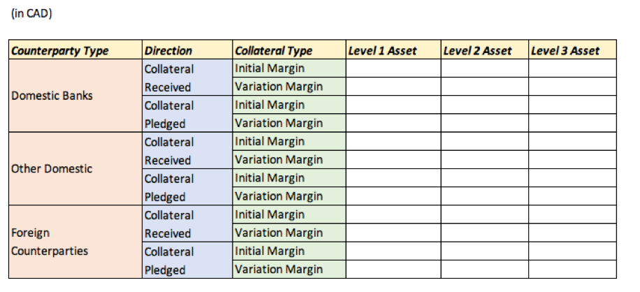

# 加拿大银行抵押品报告

 [English version](README_EN.md)

本报告的目的是向加拿大银行提供相关抵押品的数据。

这些数据对于评估交易对手方与活动之间的联系以及确定不同资产类别之间交易的规模是十分重要的。

此报告使用SQL对原始Excel数据进行提取，整理，处理，分析等。

由此达到报告目的并为加拿大银行提供数据分析后的有效商业建议。

## 背景资料

此业务只在工作日内进行。工作日定义为除联邦和省级法定假日外的所有工作日。

所附模板标识了只需要在每月底更新数据。每个工作日都需要在表格内填写相应数据。



### 资产类型定义

一级资产:政府债券

二级资产:非金融公司债券/股权，信用评级在A - AAA之间。

第三级资产:金融公司债券/股权，或非金融公司债券/股权，信用评级低于A。

### 原始数据
[Collateral transactions as of Jul 2016](原始数据/collateraltransaction.csv)

[Security instrument details](原始数据/security.csv)

[Counterparty details](原始数据/customer.csv)

## 操作流程

### 在SQL数据库创建新表格并导入原始数据

通过以下命令完成：

``` SQL
DROP TABLE IF EXISTS Col_Trans;
CREATE TABLE Col_Trans (
	`Process_Date`	TEXT,
	`Trade_ID`	TEXT,
	`Transaction_Date`	TEXT,
	`Currency`	TEXT,
	`Customer_ID`	TEXT,
	`Encum_Status`	NUMERIC,
	`Product_Type`	TEXT,
	`PV`	DECIMAL(12,2),
	`PV_CDE`	DECIMAL(12,2),
	`Encum_Mat_Date`	TEXT,
	`Margin_Type`	TEXT,
	`Security_ID`	TEXT,
	`Post_Direction`	TEXT,
	`CSA_ID`	TEXT,
	`Quantity`	NUMERIC
);


DROP TABLE IF EXISTS Customer;
CREATE TABLE Customer (
	`Customer_ID`	TEXT,
	`Customer_Name`	TEXT,
	`Industry`	TEXT,
	`Jurisdiction`	TEXT,
	`CreditRating`	TEXT
);


DROP TABLE IF EXISTS Sec;
CREATE TABLE Sec (
	Security_ID	TEXT,
	Security_ID_2	TEXT,
	Issuer	TEXT,
	Issuer_Credit_Rating	TEXT,
	Industry	TEXT,
	Currency	TEXT,
	Security_Type	TEXT,
	Maturity_date	TEXT,
	Issue_Date	TEXT,
	Coupon	TEXT,
	Price	FLOAT,
	Factor	TEXT,
	MTM_Date	TEXT,
	Fixed_Flag	TEXT,
	primary key (Security_ID)
);
```

创建三个表头齐全的空白表格并分别从Excel中导入所需要的原始数据。

‘Col_Trans’记录了2016年间100笔重要交易的信息

‘Customer’ 记录着10位客户的个人背景及所需信息

‘Sec’记录了所有交易的抵押品信息

### 整理并归类原始数据

``` SQL
create table cust2 as
select
      *,
      case
          when industry = 'Financial' and jurisdiction = 'Canada' then 'Domestic Banks'
          when industry <> 'Financial' and jurisdiction = 'Canada' then 'Other Domestic'    
          else 'Foreign Cpty'
      end as cpty_type
from customer
;


create table sec2 as
select
      *,
      case
          when industry = 'Sovereign' and security_type = 'Bond' then 'Level_1_Asset'
          when industry not in ('Sovereign', 'Financial', 'Insurance') 
            and issuer_credit_rating like 'A%' and issuer_credit_rating <> 'A-' then 'Level_2_Asset'
          else 'Level_3_Asset'                                                                          
      end as asset_class
from sec
;
```

按照要求，此步骤是在创建原始表之后整理和分类所有提供的原始数据。

创建新表格' cust2 '，从原' Customer '表中选择所有列，并使用' Case When '语句将所有客户筛选并分类为与模板对称的三种对手类型。

创建‘sec2’表格方法相同，将资产按照要求分为三种不同等级。
