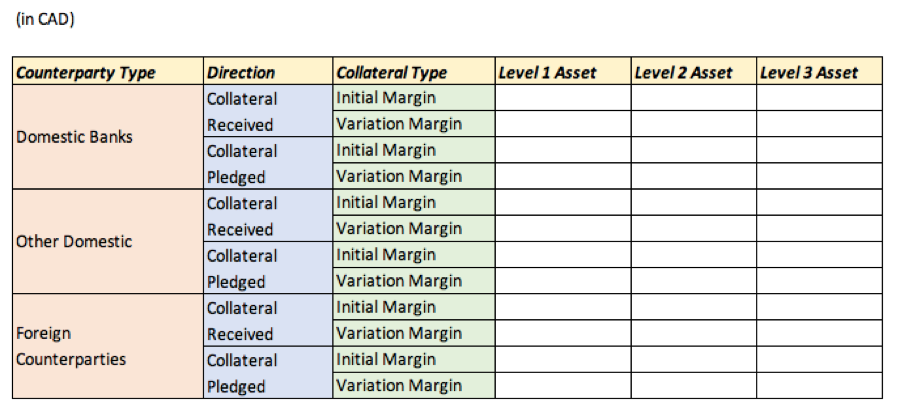
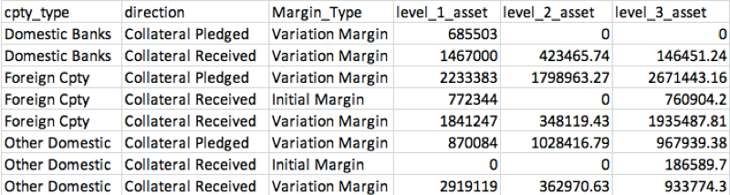
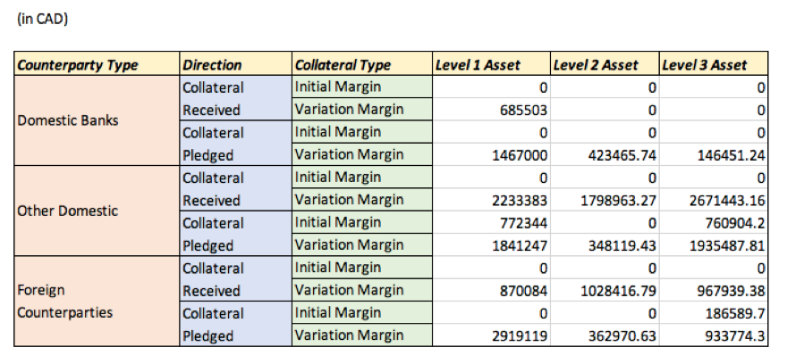
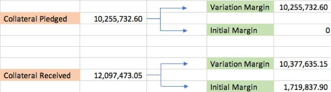

# Bank of Canada Collateral and Pledging Report

[Chinese Version](README.md)

The purpose of this report is to provide the Bank of Canada with data on collateral pledging

which is necessary for evaluating linkages between counterparties and activities, as well as

determining the magnitude of transactions across various asset classes.


## Background Information

This return is to be completed at the business day frequency. 

Business days are defined to include all weekdays except federal and provincial statutory holidays. 

The attached template identifies a selection of rows and columns which are only required to be updated as of month end. 

Values are required to be reported in these cells for every business day; 

however, previousvalues can be carried forward until month end is reached.




### Definition for asset types

Level 1 Asset: Government Bond

Level 2 Asset: Non-financial corporate bond/equity, with credit rating between A and AAA.

Level 3 Asset: Financial corporate bond/equity, or non-financial corporate bond/equity with credit rating under A.


### Provided Inputs
[Collateral transactions as of Jul 2016](原始数据/collateraltransaction.csv)

[Security instrument details](原始数据/security.csv)

[Counterparty details](原始数据/customer.csv)

## Solving Steps

### Create empty tables and import the provided inputs

Following queries: 

``` SQL
DROP TABLE IF EXISTS Col_Trans;
CREATE TABLE Col_Trans (
	`Process_Date`	TEXT,
	`Trade_ID`	TEXT,
	`Transaction_Date`	TEXT,
	`Currency`	TEXT,
	`Customer_ID`	TEXT,
	`Encum_Status`	NUMERIC,
	`Product_Type`	TEXT,
	`PV`	DECIMAL(12,2),
	`PV_CDE`	DECIMAL(12,2),
	`Encum_Mat_Date`	TEXT,
	`Margin_Type`	TEXT,
	`Security_ID`	TEXT,
	`Post_Direction`	TEXT,
	`CSA_ID`	TEXT,
	`Quantity`	NUMERIC
);


DROP TABLE IF EXISTS Customer;
CREATE TABLE Customer (
	`Customer_ID`	TEXT,
	`Customer_Name`	TEXT,
	`Industry`	TEXT,
	`Jurisdiction`	TEXT,
	`CreditRating`	TEXT
);


DROP TABLE IF EXISTS Sec;
CREATE TABLE Sec (
	Security_ID	TEXT,
	Security_ID_2	TEXT,
	Issuer	TEXT,
	Issuer_Credit_Rating	TEXT,
	Industry	TEXT,
	Currency	TEXT,
	Security_Type	TEXT,
	Maturity_date	TEXT,
	Issue_Date	TEXT,
	Coupon	TEXT,
	Price	FLOAT,
	Factor	TEXT,
	MTM_Date	TEXT,
	Fixed_Flag	TEXT,
	primary key (Security_ID)
);
```
These are three original tables that imported all provided inputs. 

The ‘Col_Trans’ table records all the necessary information of the 100 transactions; 

the ‘Customer’ table records 10 customer’s information and background, 

and the ‘Sec’ table is the security record. 

### Sort out and classify the data of the original tables

``` SQL
create table cust2 as
select
      *,
      case
          when industry = 'Financial' and jurisdiction = 'Canada' then 'Domestic Banks'
          when industry <> 'Financial' and jurisdiction = 'Canada' then 'Other Domestic'    
          else 'Foreign Cpty'
      end as cpty_type
from customer
;


create table sec2 as
select
      *,
      case
          when industry = 'Sovereign' and security_type = 'Bond' then 'Level_1_Asset'
          when industry not in ('Sovereign', 'Financial', 'Insurance') 
            and issuer_credit_rating like 'A%' and issuer_credit_rating <> 'A-' then 'Level_2_Asset'
          else 'Level_3_Asset'                                                                          
      end as asset_class
from sec
;
```

As requested, the next step is to filter and classify all the provided data after the original tables have been created. 

Create new table ‘cust2’ which select all the columns from ‘Customer’ table, 

and use ‘Case When’ statement to filter and classify all customer into three counterparty types that symmetric with the template. 

The same as creating table ‘sec2’ which classify the asset into three different levels.

### Join each new table with the original tables

Connect two tables through the primary key and create new tables ‘cust_join’ and ‘sec_join’.

``` SQL
  
create table cust_join as
select
      a.*,
      b.cpty_type
from col_trans a
left join cust2 b
on a.customer_id = b.customer_id
where a.product_type = 'Security'
;


create table sec_join as
select
      a.*,
      coalesce(b.asset_class, c.asset_class) asset_class     
from cust_join a
left join sec2 b
on a.security_id = b.security_id                             
left join sec2 c
on a.security_id = c.security_id_2
;
```

Join ‘Col_Trans’ with ‘cust2’ through ‘cusomer_id’ and ‘sec2’ through ’security_id’. 

Therefore, all the transactions in ‘Col_Trans’ could be classified into counterparty types and asset levels.

### Translate the data as required

```SQL
create table output as
select
      cpty_type,
      case
          when post_direction = 'Deliv to Bank' then 'Collateral Received'
          else 'Collateral Pledged'
      end as direction,
      margin_type,
      sum(case when asset_class = 'Level_1_Asset' then pv_cde else 0 end) level_1_asset,                         
      sum(case when asset_class = 'Level_2_Asset' then pv_cde else 0 end) level_2_asset,                         
      sum(case when asset_class = 'Level_3_Asset' then pv_cde else 0 end) level_3_asset
from sec_join
group by cpty_type, direction, margin_type
order by cpty_type, direction, margin_type
;
```

Select six columns from ‘sec_join’ that symmetric with the template. 

Translate ‘Deliv to Bank’ and ‘Deliv to Ctpy’ to ‘Collateral Received’ and ‘Collateral Pledged’ as the template shown. 

Based on the definition for asset types, calculate the sum value of each asset type. 



### Adjust the table format according to the template

``` SQL
create table rep_strusct as
select
      a.cpty_type,
      b.direction,
      c.margin_type
from (select distinct cpty_type from output) a
cross join (select distinct direction from output) b
cross join (select distinct margin_type from output) c
order by a.cpty_type, b.direction, c.margin_type
;


create table col_trans_report as
select
      a.cpty_type,
      a.direction,
      a.margin_type as 'Collateral Type',               
      coalesce(b.level_1_asset, 0) level_1_asset,
      coalesce(b.level_2_asset, 0) level_2_asset,
      coalesce(b.level_3_asset, 0) level_3_asset
from rep_strusct a
left join output b
on a.cpty_type = b.cpty_type
and a.direction = b.direction
and a. margin_type = b.margin_type
;
```

Cross join ‘cpty_type’ with ‘direction’ and ‘margin_type’ that expand all the alternative, 

and translate ‘margin_type’ to ‘Collateral Type’. 

Then the new table ‘rep_strusct’ symmetric with the template.

Select all six required columns and join ‘rep_strusct’ and ‘output’ to create the final report table.




## Summary



The table clearly demonstrates the collateral transactions of the central bank. 

It lent approximately 18% more assets than received. Central bank designs its own collateral policy to minimize 

the risk of counterparty default and as well as to minimize the broader impacts on the market. 

Therefore, Bank of Canada deals only with the selected, creditworthy counterparties. 

However, the transactions still have risk inherent in the collateral itself. 

According to table a, Bank of Canada trades level 3 asset the most however it has the worst credit among these three assets, 

and in which case Bank of Canada exposed under higher risk. 

As we all know, government bond is much more riskless than other assets and higher credit rating assets are 

more secure than the lower. Hence, the central bank should trades more level1&2 assets to limit its risk. 
